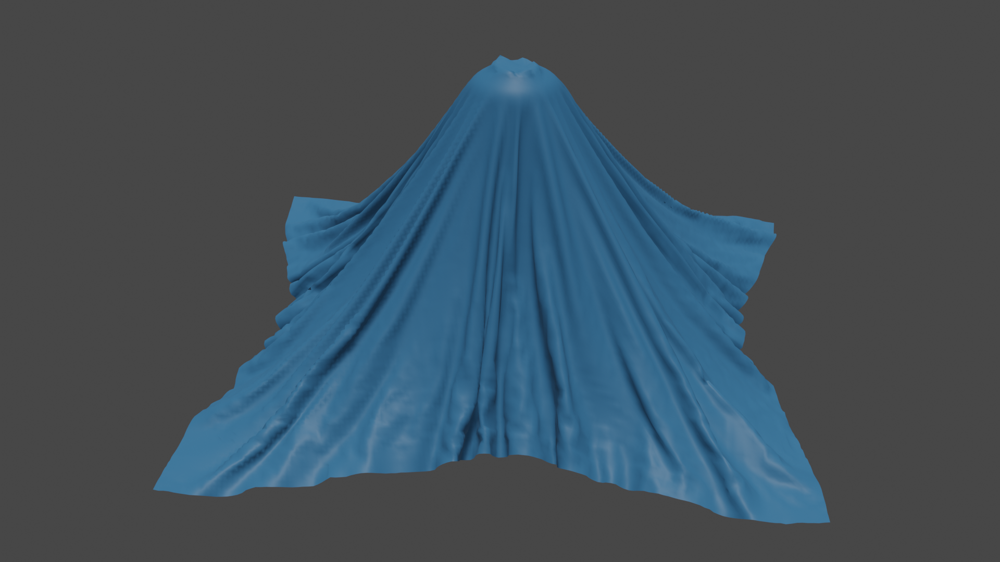
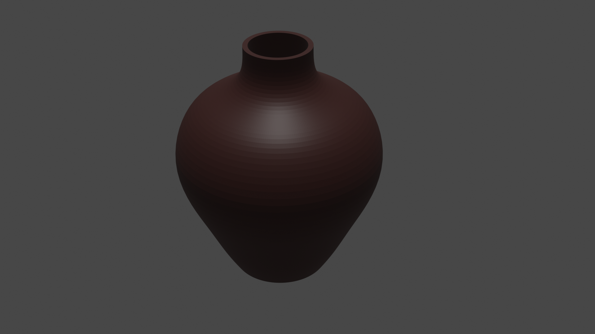
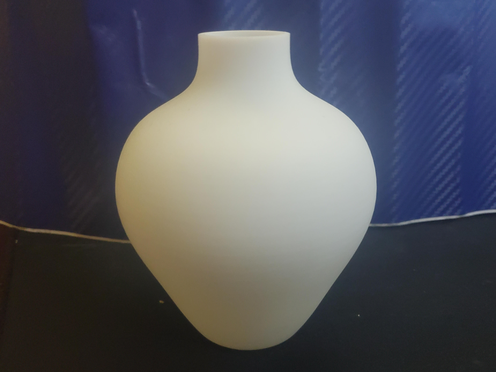

# Cloth drop test

Experimenting with [Blender's](https://www.blender.org/) physics by modelling a vase and dropping a cloth on top of it.

## 3D printing

I printed [cloth drop vase (scaled up for 3D printing).stl](cloth%20drop%20vase%20%28scaled%20up%20for%203D%20printing%29.stl) with [JLC PCB's 3D printing service](https://3d.jlcpcb.com/3d-printing-quote):

